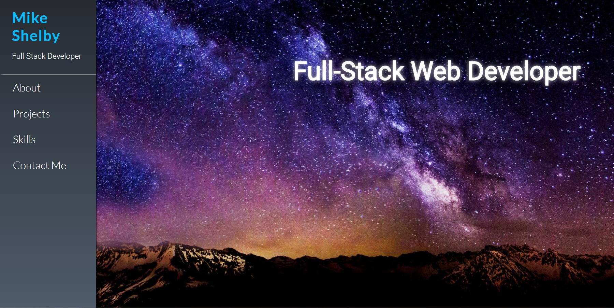

# React Portfolio

## Description and Purpose
A website that features my web development projects.

## Table of Contents
  - [Description and Purpose](#description-and-purpose)
  - [Application Screenshot](#application-screenshot)
  - [Deployed Application](#deployed-application)
  - [Built With](#built-with)
  - [License](#license)
  - [Contributing](#contributing)
  - [Questions](#questions)

## Application Screenshot

## Deployed Application
https://mikegshelby.github.io/portfolio-react/

## Built With
* React
* Node.js
* Express.js
* Javascript
* HTML
* CSS

## License
MIT License

## Contributing
* Mike Shelby

## Questions
Github Username: mikegshelby

Github Profile: https://github.com/mikegshelby

Email: mikegshelby@gmail.com

Please email me with any questions about this project!

